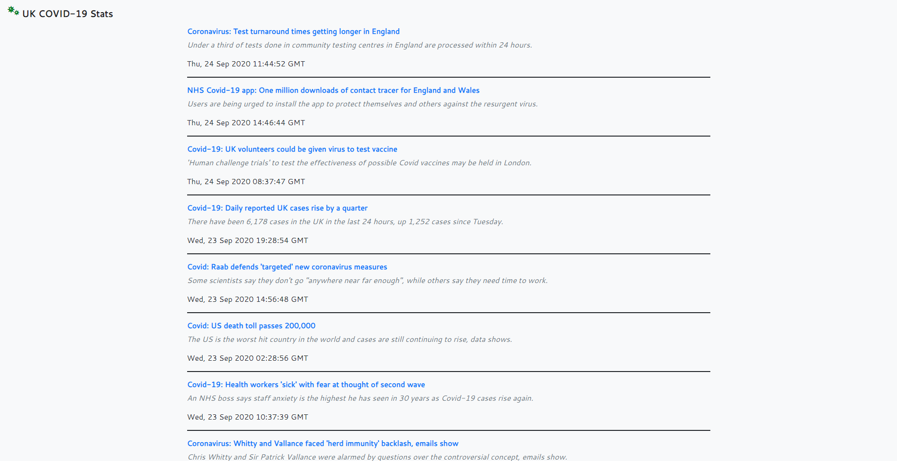

# UK-COVID-19-Stats

A simple Flask app showing how the COVID-19 (SARS-CoV-2) pandemic is developing in the UK.

## Dependencies

```pipfile
[dev-packages]
autopep8 = "*"

[packages]
uk-covid19 = "*"
flask = "*"
loguru = "*"
feedparser = "*"

[requires]
python_version = "3.8"
```

### Dependency installation

`pipenv install` or `pip install -r requirements.txt`

## Usage

### Development

1. Execute the following command to from the project directory to start the app locally:

#### PowerShell

`$Env:SECRET_KEY = $(python -c 'import os; print(os.urandom(16))'); $Env:FLASK_APP = 'app'; $Env:FLASK_ENV = 'development'; flask run`

#### Linux

`export SECRET_KEY=$(python -c 'import os; print(os.urandom(16))'); export FLASK_APP=app; export FLASK_ENV=development; flask run`

### Docker

1. Build the container image: `docker build . --tag uk-covid19-stats:0.0.1 --no-cache`

2. Run the container image: `docker run -e "SECRET_KEY=$(python -c 'import os; print(os.urandom(16))')" -e "FLASK_APP='app'" -e "FLASK_HOST=0.0.0.0" --name uk-covid19-stats --rm -d -p 5000:5000 uk-covid19-stats:0.0.1`

3. Head to [localhost:5000](http://localhost:5000) in your browser to view the application.

## App images




## Data provider

Data is provided by the Public Health England COVID-19 API.

For more information see the [API documentation](https://coronavirus.data.gov.uk/developers-guide).

## Authors -- Contributors

* **dbrennand** - *Author* - [dbrennand](https://github.com/dbrennand)

## License
This project is licensed under the MIT License - see the [LICENSE](LICENSE) for details.
